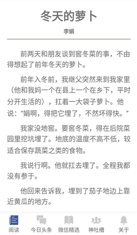

# toiletReading


**[Deprecated]** 偶尔回来瞥一眼看看以前写的破玩意...

**Support:**

Android 4.4+  
IOS（unknown）


## Screenshot
 
 


## Download
[豌豆荚](http://www.wandoujia.com/apps/com.toiletreading)  
应用宝：未上线，涉及到新闻功能，需要互联网《 互联网新闻信息服务许可证 》才能上线。。  
豌豆荚合并到了阿里，现在也需要许可证了。。

## Attension！
> * 由于gradle版本问题产生的bug，我更改了gradle版本为gradle-2.14.1-all，目录为android/gradle/wrapper/gradle-wrapper.properties。同时我更改了com.android.tools.build:gradle:2.2.2，目录为android/build.gradle。
> * gradle下载可能会有网络问题，建议预先下载gradle-2.14.1-all.zip文件并置于android/gradle/wrapper/目录下，同时将android/gradle/wrapper/gradle-wrapper.properties中的distributionUrl=...改为distributionUrl=gradle-2.14.1-all.zip
> * （摊手


## Development Workflow

### Step One

```
npm install -g react-native-cli
```
### Step Two

```
npm install
```
### Step Three

```
react-native start  
react-native run-android
```


## Todo
> * app架构优化。
> * 引入redux，今日头条多个ListView的数据管理优化。
> * 代码细节优化，抽离工具类函数和通用组件。
> * 微信精选数据源更换。（基本不更新的源数据，好坑T_T）
> * 其它功能的开发。
> * 有什么好的想法，来issue告诉我吧~~

